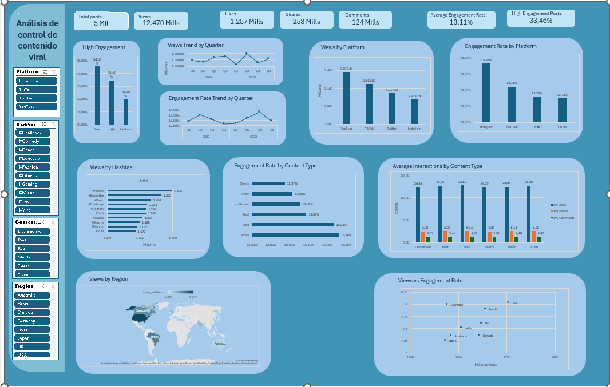

# dataProject_dashBoard_AnalisisDeDatos

Dataset Cleaned_Viral_Social_Media_Trends.csv 
analizado por Eduardo Calderón Flores.

# 🧱 Estructura del fichero excel

  ## 📄  *Hoja 1 → tblPosts* 
  Tabla estructurada del dataset seleccionado para el proyecto.

     📐 Métrica clave creadas en la tabla original
      - Columnas nuevas (calculadas):
        Interactions = Likes + Shares + Comments
        Engagement_Rate = Interactions / Views

  ## 📄  *Hoja 2 → dat_validaciones*
  Validación de datos originales: quitar duplicados, validar que no contenga datos vacios, etc.

  ## 📄  *Hoja 3 → Base_Pivot*
  Tablas dinámicas que alimentan al dashboard

  ## 📄  *Hoja 3 → map_data*
  Tabla que alimenta la gráfica de mapa (datos origen -> tblPost )

  ## 📄  *Hoja 4 → Scatter_Data*
  Tabla que alimenta la gráfica de scatter (datos origen -> tblPost )

  ## 📄  *Hoja 5 → Dashboard*
  KPI y gráficas con segmentadores

# 📊 Análisis Descriptivo Inicial del Dataset

Este dataset recoge información sobre publicaciones virales en varias redes sociales. Incluye datos temporales, temáticos, geográficos y métricas de interacción, lo que permite entender cómo se comporta el contenido digital en diferentes plataformas.

## 🗓️ *1. Dimensión temporal (Post_Date)*

La fecha de publicación permite:

- Identificar tendencias a lo largo del tiempo.
- Analizar cómo evoluciona el engagement por periodos.
- Relacionar picos de viralidad con eventos o momentos concretos.
- Aporta contexto y orden cronológico al comportamiento del contenido.

## 📱 *2. Plataforma (TikTok, Instagram, Twitter, YouTube)*

Cada plataforma tiene algoritmos, formatos y audiencias distintas. Esto permite:

- Comparar el rendimiento entre redes.
- Ver dónde se concentra el contenido viral.
- Detectar qué formatos funcionan mejor en cada plataforma.

## 🔥 *3. Hashtags (temas o tendencias)*

Los hashtags clasifican el contenido por temática. Gracias a ellos se puede:

- Identificar los temas más virales.
- Analizar qué categorías generan más interacción.
- Detectar patrones de viralidad asociados a tendencias (#Gaming, #Education, #Comedy, etc.).

## 🎬 *4. Tipo de contenido (Content_Type)*

Incluye formatos como Video, Shorts, Reel, Post, Live Stream o Tweet. Permite:

- Comparar el rendimiento entre formatos.
- Ver qué tipo de contenido genera más interacción.
- Analizar la evolución de formatos cortos vs. largos.

## 🌍 *5. Región*

La región añade una dimensión geográfica que permite:

Identificar mercados con mayor viralidad.
Comparar comportamientos entre países.
Detectar si ciertos temas funcionan mejor en regiones específicas.

## 📈 *6. Métricas cuantitativas (Views, Likes, Shares, Comments)*

Estas métricas miden el rendimiento de cada publicación:

- Views: alcance
- Likes: aprobación
- Shares: viralidad
- Comments: interacción activa

Permiten analizar:

- Distribuciones y rangos.
- Valores atípicos (posts extremadamente virales).
- Comparaciones entre plataformas, hashtags o regiones.
- Relaciones entre métricas (por ejemplo, muchas views pero pocos likes).

También permiten calcular indicadores derivados como:

- Tasa de interacción
- Ratio de compartidos por visualización
- Comentarios por like

## ⭐ *7. Engagement_Level (Low, Medium, High)*

Clasifica el rendimiento global de cada publicación. Es útil para:

- Identificar rápidamente qué contenido funciona mejor.
- Comparar grupos sin cálculos adicionales.
- Detectar patrones comunes en publicaciones de alto engagement.

## 🧩 *¿Qué aporta este dataset en conjunto?*

Este dataset permite:

- Entender cómo se comporta el contenido viral en distintas plataformas.
- Analizar qué temas, formatos y regiones generan más interacción.
- Detectar patrones temporales de viralidad.
- Comparar métricas de rendimiento entre categorías.
- Identificar factores asociados a niveles altos de engagement.
- Construir modelos predictivos o segmentaciones basadas en comportamiento.

En resumen, es un dataset rico, multidimensional y muy útil para análisis de tendencias digitales, ideal para:

- Exploración inicial
- Visualización de patrones
- Modelos de predicción de engagement
- Estudios de comportamiento por plataforma o región

# 🚀 Dashboard

El dashboard responderá a 4 preguntas clave:

- ¿Cómo evoluciona el rendimiento en el tiempo?
- ¿Qué plataforma y formato funcionan mejor?
- ¿Qué temas (hashtags) generan más engagement?
- ¿Dónde (región) se genera más viralidad?

## 📉  KPIs 

KPI	                        Tabla Dinámica
- Total Views	                PT_KPI_TotalViews
- Total Likes	                PT_KPI_TotalLikes
- Total Shares	              PT_KPI_TotalShares
- Total Comments	            PT_KPI_TotalComments
- Engagement Rate Promedio	  PT_KPI_AvgEngRate
- % Posts High Engagement	    PT_KPI_PctHighEng

## 📈 Gráficas
### *GRÁFICA 1 — Views Trend by Quarter*

How is total reach evolving over time?
PT_TR_ViewsByQuarter

### *GRÁFICA 2 — Engagement Rate Trend by Quarter*

La primera mostraba volumen, ésta muestra calidad.
PT_TR_EngRateByQuarter

### *GRÁFICA 3 — Views by Platform*

Which platform generates the highest reach?
PT_ANL_ViewsByPlatform

### *GRÁFICA 4 — Engagement Rate by Platform*

Which platform generates better engagement quality?
PT_ANL_EngRateByPlatform

### *GRÁFICA 5 — Engagement Level Distribution*

What is the distribution of post performance?
PT_DIST_EngLevel

### *GRÁFICA 6 — Views by Hashtag*

How does reach compare across all content themes?
PT_ANL_ViewsByHashtag

### *GRÁFICA 7 — Engagement Rate by Content Type*

Which content format generates better engagement quality?
PT_ANL_EngRateByContent

### *GRÁFICA 8 — Average Interactions by Content Type*

How do interaction types behave by format?
PT_ANL_AvgInteractionsByContent

### *GRÁFICA 9 — Views by Region*

Which regions generate the highest reach?
map_data (PT_GEO_RegionPerformance)

### *GRÁFICA 10 — Views vs Engagement Rate*
¿Más views significa mejor engagement?
Scatter_Data (PT_GEO_RegionPerformance)

## 🎛 Segmentadores 

slicers:

- Platform			SLR_FLT_Platform
- Hashtag			  SLR_FLT_Hashtag
- Content_Type	SLR_FLT_ContentType
- Region			  SLR_FLT_Region

Todos conectados a todas las tablas dinámicas. 
Esto, permite tener un dashboard interactivo.

# Executive Summary — Social Media Performance Dashboard
El dashboard permite identificar dónde invertir, optimizar o escalar estratégicamente.

## 1️⃣ Tendencia Temporal (Views by Quarter)

Se observan trimestres con picos claros de alcance, lo que indica estacionalidad en el consumo.

Algunos quarters concentran gran parte del volumen total, lo que sugiere campañas o tendencias puntuales.

No hay una caída estructural sostenida, lo que indica estabilidad en la generación de alcance.

Interpretación:
La performance depende más de momentos estratégicos que de un crecimiento lineal continuo.

## 2️⃣ Plataforma (Platform Performance)

No todas las plataformas convierten alcance en engagement al mismo nivel.

Algunas muestran alto volumen de views pero menor engagement rate.

Otras, con menor alcance, presentan mayor eficiencia en interacción.

Insight clave:
Alcance ≠ Calidad de interacción.
Hay plataformas que funcionan mejor para visibilidad y otras para engagement.

## 3️⃣ Hashtags (Content Themes)

Algunos hashtags concentran gran parte del engagement.

Los temas más virales no siempre son los que más engagement generan.

Existe concentración temática (pocos hashtags explican gran parte del rendimiento).

Insight estratégico:
Conviene priorizar los hashtags que combinan alcance + engagement, no solo volumen.

## 4️⃣ Tipo de Contenido (Content Type)

Los formatos cortos (Shorts/Reels) tienden a generar alto alcance.

Los formatos más interactivos (Live / Video) muestran engagement relativamente más fuerte.

No todos los formatos se comportan igual en todas las plataformas.

Insight:
El formato influye directamente en el tipo de interacción que se obtiene.

## 5️⃣ Distribución de Engagement Level

La mayoría de posts se concentran en nivel Medium.

Los High Engagement son menos frecuentes pero explican una parte relevante del impacto total.

Existe margen para optimizar hacia una mayor proporción de High.

Insight:
El éxito alto es posible pero no dominante; hay oportunidad clara de optimización.

## 6️⃣ Análisis Geográfico (Mapa)

Algunos países concentran gran volumen de views.

No todos los países con alto alcance presentan alto engagement.

Existen mercados “eficientes” (menos views pero mayor tasa de interacción).

Insight estratégico:
Los mercados prioritarios pueden definirse por eficiencia, no solo por volumen.

## 7️⃣ Reach vs Engagement (Scatter Analysis)

El gráfico de dispersión permite identificar cuatro escenarios:

Alto alcance + Alto engagement
→ Mercados ideales. Mantener o aumentar inversión.

Alto alcance + Bajo engagement
→ Problema potencial de contenido o segmentación.

Bajo alcance + Alto engagement
→ Oportunidad de escalar inversión.

Bajo alcance + Bajo engagement
→ Bajo impacto estratégico.

El valor de R² muestra que la correlación entre views y engagement no es perfecta, confirmando que la viralidad no garantiza interacción.

# 🎯 Conclusiones Generales

El rendimiento depende más del tipo de contenido y la plataforma que del volumen bruto.

Engagement no está directamente correlacionado con views.

Existen oportunidades claras de optimización por:

- Plataforma
- Hashtag
- Región
