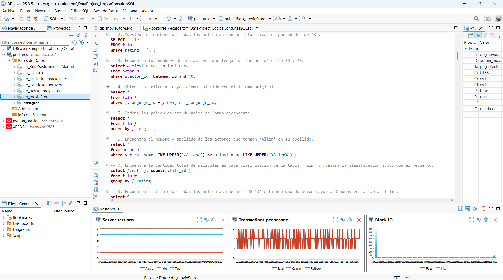

# DataProject: LógicaConsultasSQL

# 📘 README — Consultas SQL para la Base de Datos **db_movieStore**

Este documento resume el trabajo realizado para practicar y resolver consultas SQL sobre la base de datos **db_movieStore**, un modelo similar al clásico *Sakila* utilizado para aprender SQL relacional.

Fichero de consultas: **ecalderonf_DataProject_LogicaConsultasSQL.sql**

---

## 🎯 Objetivo del proyecto

El propósito fue desarrollar y ejecutar una serie de consultas SQL que abarcan distintos niveles de complejidad, desde operaciones básicas de selección y filtrado hasta el uso de:

- **JOINs** (INNER, LEFT, CROSS)
- **CTEs (Common Table Expressions)**
- **Subconsultas**
- **Funciones de agregación**
- **Vistas**
- **Agrupaciones y filtros avanzados**

Estas consultas permiten explorar y comprender la estructura de la base de datos, así como las relaciones entre sus tablas principales: *film*, *actor*, *customer*, *rental*, *inventory*, *category*, entre otras.

---

## 🧪 Consultas realizadas

A lo largo del ejercicio resolvimos más de 60 consultas SQL, entre ellas:

- Películas alquiladas por un cliente específico.
- Actores que han participado en películas de una categoría concreta.
- Películas con duración similar a otra usando CTEs.
- Clientes que han alquilado un número mínimo de películas distintas.
- Conteo de alquileres por categoría mediante CTEs.
- Creación de vistas para análisis por año.
- Generación de combinaciones entre empleados y tiendas.
- Identificación de actores que **no** han participado en ciertas categorías.
- Cálculo de días de alquiler y filtrado por duración.

Cada consulta fue diseñada para reforzar conceptos clave de SQL y buenas prácticas de modelado y consulta.

---

## 🏗️ Preparación del entorno en PostgreSQL y DBeaver

Para ejecutar las consultas fue necesario:

1. **Crear la conexión** a PostgreSQL desde DBeaver.  
2. **Crear la base de datos** donde se cargaría el esquema.  
3. **Crear el esquema** (o usar *public*).  
4. **Configurar el search_path** si se usó un esquema personalizado.  
5. **Ejecutar el script SQL** del dump para generar:
   - Secuencias  
   - Tablas  
   - Relaciones  
   - Índices  
   - Comentarios  
6. **Crear tablas adicionales** del modelo E/R si no estaban en el dump.  
7. **Verificar la estructura** y realizar consultas de prueba.

---

## 📂 Estructura general de la base de datos

La base de datos **db_movieStore** incluye entidades como:

- **Películas** (`film`)
- **Actores** (`actor`)
- **Categorías** (`category`)
- **Clientes** (`customer`)
- **Inventario** (`inventory`)
- **Alquileres** (`rental`)
- **Tiendas** (`store`)
- **Empleados** (`staff`)
- **Direcciones, ciudades y países**

Estas tablas están relacionadas mediante claves primarias y foráneas que permiten consultas complejas y análisis detallados.

---

## 📌 Resultado final

Fichero de consultas: **ecalderonf_DataProject_LogicaConsultasSQL.sql**

El proyecto permitió:

- Comprender a fondo la estructura de una base de datos relacional realista.
- Practicar consultas SQL avanzadas.
- Aplicar CTEs, vistas, joins y subconsultas en escenarios prácticos.
- Preparar y gestionar una base de datos completa en PostgreSQL usando DBeaver.

Este README sirve como referencia del trabajo realizado y como guía para futuras ampliaciones o ejercicios adicionales.

1. Crea el esquema de la BBDD.

2. Muestra los nombres de todas las películas con una clasificación por edades de ‘Rʼ.

3. Encuentra los nombres de los actores que tengan un 'actor_id' entre 30 y 40.

4. Obtén las películas cuyo idioma coincide con el idioma original.

5. Ordena las películas por duración de forma ascendente.

6. Encuentra el nombre y apellido de los actores que tengan ‘Allenʼ en su apellido.

7. Encuentra la cantidad total de películas en cada clasificación de la tabla 'film' y muestra la clasificación junto con el recuento.

8. Encuentra el título de todas las películas que son ‘PG-13ʼ o tienen una duración mayor a 3 horas en la tabla 'film'.

9. Encuentra la variabilidad de lo que costaría reemplazar las películas.

10. Encuentra la mayor y menor duración de una película de nuestra BBDD.

11. Encuentra lo que costó el antepenúltimo alquiler ordenado por día.

12. Encuentra el título de las películas en la tabla 'film' que no sean ni ‘NC-17ʼ ni ‘Gʼ en cuanto a su clasificación.

13. Encuentra el promedio de duración de las películas para cada clasificación de la tabla 'film' y muestra la clasificación junto con el promedio de duración.

14. Encuentra el título de todas las películas que tengan una duración mayor a 180 minutos.

15. ¿Cuánto dinero ha generado en total la empresa?

16. Muestra los 10 clientes con mayor valor de id.

17. Encuentra el nombre y apellido de los actores que aparecen en la película con título ‘Egg Igbyʼ.

18. Selecciona todos los nombres de las películas únicos.

19. Encuentra el título de las películas que son comedias y tienen una duración mayor a 180 minutos en la tabla 'film'.

20. Encuentra las categorías de películas que tienen un promedio de duración superior a 110 minutos y muestra el nombre de la categoría junto con el promedio de duración.

21. ¿Cuál es la media de duración del alquiler de las películas?

22. Crea una columna con el nombre y apellidos de todos los actores y actrices.

23. Número de alquileres por día, ordenados por cantidad de alquiler de forma descendente.

24. Encuentra las películas con una duración superior al promedio.

25. Averigua el número de alquileres registrados por mes.

26. Encuentra el promedio, la desviación estándar y varianza del total pagado.

27. ¿Qué películas se alquilan por encima del precio medio?

28. Muestra el id de los actores que hayan participado en más de 40 películas.

29. Obtener todas las películas y, si están disponibles en el inventario, mostrar la cantidad disponible.

30. Obtener los actores y el número de películas en las que ha actuado.

31. Obtener todas las películas y mostrar los actores que han actuado en ellas, incluso si algunas películas no tienen actores asociados.

32. Obtener todos los actores y mostrar las películas en las que han actuado, incluso si algunos actores no han actuado en ninguna película.

33. Obtener todas las películas que tenemos y todos los registros de alquiler.

34. Encuentra los 5 clientes que más dinero se hayan gastado con nosotros.

35. Selecciona todos los actores cuyo primer nombre es 'Johnny'.

36. Renombra la columna 'first_name' como **Nombre** y 'last_name' como **Apellido**.

37. Encuentra el ID del actor más bajo y más alto en la tabla 'actor'.

38. Cuenta cuántos actores hay en la tabla 'actor'.

39. Selecciona todos los actores y ordénalos por apellido en orden ascendente.

40. Selecciona las primeras 5 películas de la tabla 'film'.

41. Agrupa los actores por su nombre y cuenta cuántos actores tienen el mismo nombre.  
    ¿Cuál es el nombre más repetido?

42. Encuentra todos los alquileres y los nombres de los clientes que los realizaron.

43. Muestra todos los clientes y sus alquileres si existen, incluyendo aquellos que no tienen alquileres.

44. Realiza un CROSS JOIN entre las tablas 'film' y 'category'.  
    ¿Aporta valor esta consulta?  
    ¿Por qué?  
    Deja después de la consulta la contestación.

45. Encuentra los actores que han participado en películas de la categoría 'Action'.

46. Encuentra todos los actores que no han participado en películas.

47. Selecciona el nombre de los actores y la cantidad de películas en las que han participado.

48. Crea una vista llamada 'actor_num_peliculas' que muestre los nombres de los actores y el número de películas en las que han participado.

49. Calcula el número total de alquileres realizados por cada cliente.

50. Calcula la duración total de las películas en la categoría 'Action'.

51. Crea una tabla temporal llamada 'cliente_rentas_temporal' para almacenar el total de alquileres por cliente.

52. Crea una tabla temporal llamada 'peliculas_alquiladas' que almacene las películas que han sido alquiladas al menos 10 veces.

53. Encuentra el título de las películas que han sido alquiladas por el cliente con el nombre 'Tammy Sanders' y que aún no se han devuelto.  
    Ordena los resultados alfabéticamente por título de película.

54. Encuentra los nombres de los actores que han actuado en al menos una película que pertenece a la categoría 'Sci-Fi'.  
    Ordena los resultados alfabéticamente por apellido.

55. Encuentra el nombre y apellido de los actores que han actuado en películas que se alquilaron después de que la película 'Spartacus Cheaper' se alquilara por primera vez.  
    Ordena los resultados alfabéticamente por apellido.

56. Encuentra el nombre y apellido de los actores que no han actuado en ninguna película de la categoría 'Music'.

57. Encuentra el título de todas las películas que fueron alquiladas por más de 8 días.

58. Encuentra el título de todas las películas que son de la misma categoría que 'Animation'.

59. Encuentra los nombres de las películas que tienen la misma duración que la película con el título 'Dancing Fever'.  
    Ordena los resultados alfabéticamente por título de película.

60. Encuentra los nombres de los clientes que han alquilado al menos 7 películas distintas.  
    Ordena los resultados alfabéticamente por apellido.

61. Encuentra la cantidad total de películas alquiladas por categoría y muestra el nombre de la categoría junto con el recuento de alquileres.

62. Encuentra el número de películas por categoría estrenadas en 2006.

63. Obtén todas las combinaciones posibles de trabajadores con las tiendas que tenemos.

64. Encuentra la cantidad total de películas alquiladas por cada cliente y muestra el ID del cliente, su nombre y apellido junto con la cantidad de películas alquiladas.
