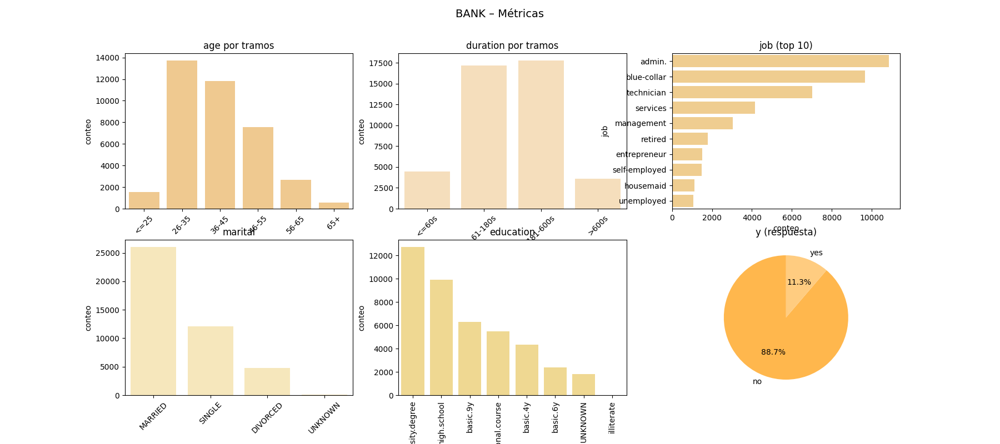
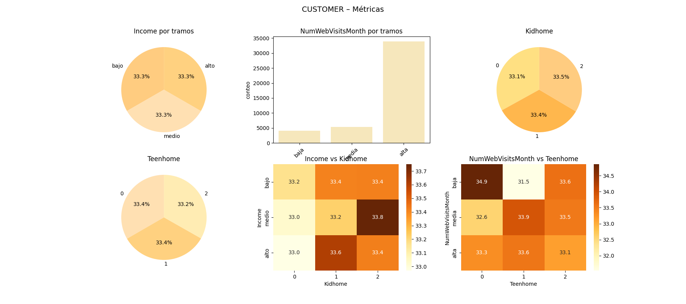
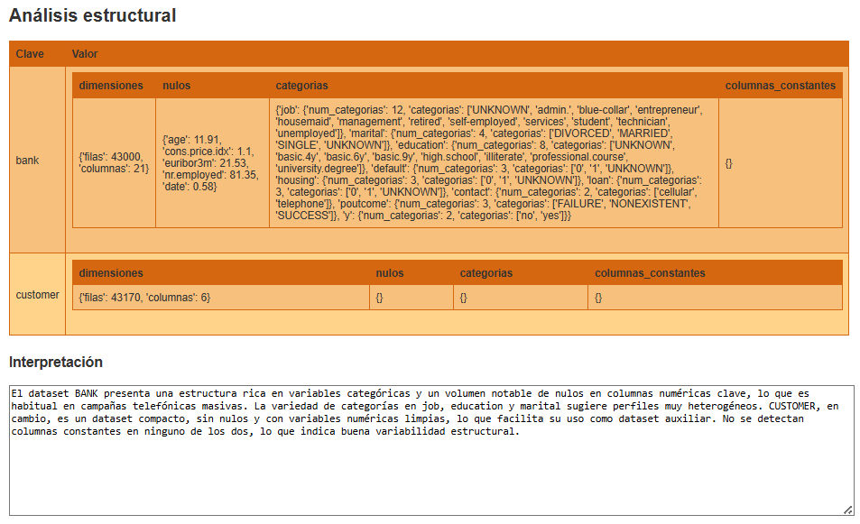
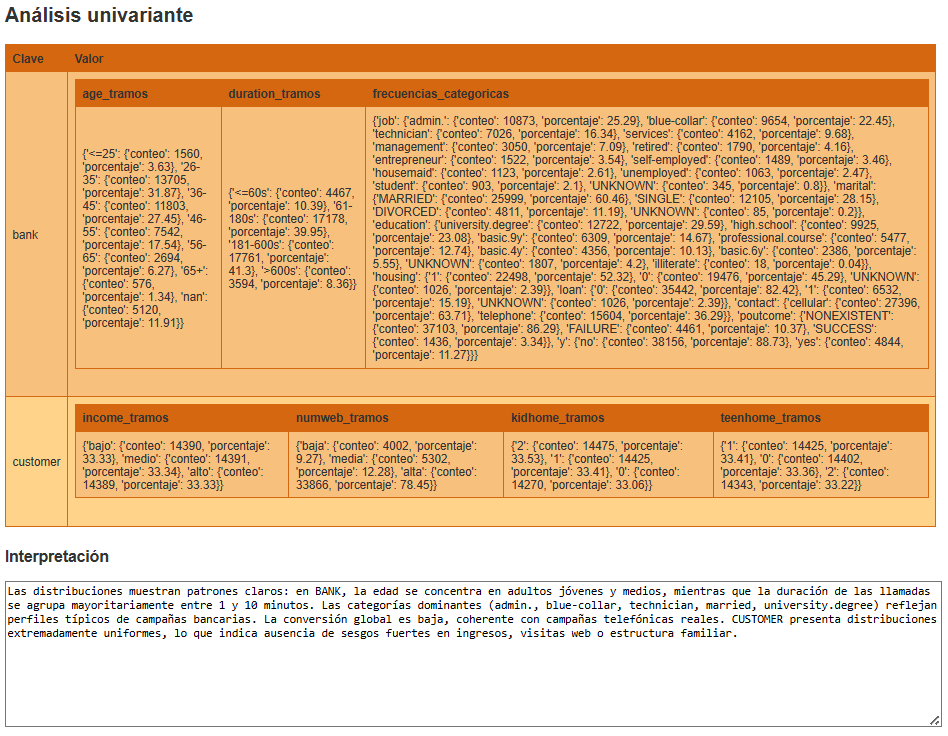
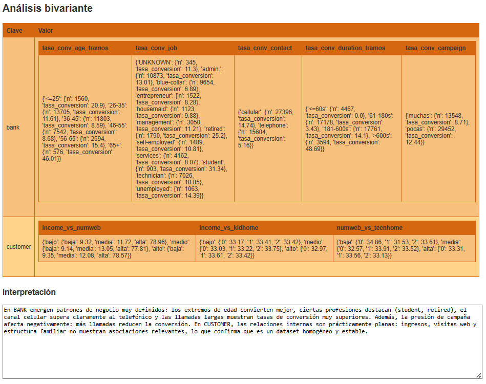

# Proyecto EDA – Campaña de marketing bancario

Este proyecto realiza un análisis exploratorio de datos (EDA) sobre dos fuentes:

- Un fichero **CSV** (`bank-additional.csv`)
- Un fichero **Excel** (`customer.xlsx` o equivalente)

El objetivo es contar con un flujo **reproducible**, con datos **limpios** y un **EDA automático** listo para revisión.

El script de python proporciona un flujo estable, reproducible y trazable, desde los datos en bruto hasta un EDA completo, 
con limpieza documentada, análisis descriptivo, visión de datos y un informe explicativo.

---
## Stack tecnológico

### Lenguaje
- Python 3.x

### Librerías necesarias

**Sistema y utilidades**
- os → gestión de rutas y sistema de archivos  
- shutil → copia de ficheros  
- openpyxl → lectura de Excel
- json → lectura/escritura de estructuras JSON  
- webbrowser → apertura automática del informe HTML  

**Análisis y manipulación de datos**
- pandas → carga, limpieza, transformación y análisis  
- numpy → operaciones numéricas y manejo de NaN  
- typing (Any, Dict) → tipado estático para funciones  

**Visualización**
- matplotlib.pyplot → backend de gráficos  
- seaborn → gráficos estadísticos y estilizados 

---

## Flujo general del proyecto

0. **Ejecutar script main.py**
   - El script pregunta al usuario: ¿Generar EDA? (s/n)?:
   - Para ejecutar el proceso, escribir **s** y pulsar [Enter].
   - Para salir, escribir **n**  y pulsar [Enter].
   - Cualquier otra opción devuelve mensaje de error: Opción inválida y vuelve a preguntar hasta obtener una respuesta válida s/n.

1. **Opción s (Ejecuta el proceso)**
   - Se valida que existan las carpetas y ficheros de entrada.
   - Comprobación de que los ficheros no estén vacíos y sean legibles.
   - Limpieza y transformación de datos de ambos ficheros
   - Análisis descriptivo
   - Visualización de datos (gráficos y tablas resumen)
   - Generar informe explicativo del análisis.
   - Genera trazas de todo el proceso,
   - Si el proceso termina con éxito Imprime **¡SUCESS!**

---
## Estructura del proyecto

```text
.
├── data
│   ├── raw
│   │   ├── bank-additional.csv
│   │   └── customer.xlsx
│   └── processed
│       ├── bank-additional-processed.csv
│       └── customer-processed.xlsx
├── reports
│   ├── img
│   │   ├── bank_metricas.png
│   │   └── customer_metricas.png
│   └── informe_EDA.html
└── src
    ├── main.py
    ├── utils_ficheros.py
    ├── utils_limpieza.py
    ├── utils_analisis_descriptivo.py
    ├── utils_visualizacion_datos.py

```

## Ficheros

### src/main.py
- Controla todo el flujo
- Es el punto de entrada del proyecto.

### src/utils_ficheros.py
Funciones para:
- Validar carpetas
- Validar ficheros
- Comprobar tamaño
- Verificar legibilidad
- Genera informe en formato html

### src/utils_limpieza.py
IncluyeFunciones para:
- Conversión de comas a float
- Conversión de tipos numéricos
- Conversión de fechas (Excel y español)
- Normalización de categorías
- Eliminación de duplicados
- Limpieza específica de BANK y CUSTOMER
- Generación de cifras de control

### src/utils_analisis_descriptivo.py
Incluye funciones para:
- Cálculo de métricas descriptivas (dimensiones, nulos, categorías, constantes)
- Análisis univariante (tramos numéricos y frecuencias categóricas)
- Tasas de conversión por grupos (solo BANK)
- Análisis bivariante interno de CUSTOMER (tablas cruzadas entre tramos y variables familiares)
- Generación de cifras de control para cada bloque analítico

### src/utils_visualizacion_datos.py
Funciones para:

Visualizaciones exploratorias del proyecto, organizadas en paneles compactos y mostradas directamente en consola. 
Su propósito es ofrecer una visión rápida, simultánea y estructurada de las principales métricas de los datasets BANK y CUSTOMER.

- **Construcción de tramos numéricos**  
  Segmentación de variables continuas en rangos definidos para facilitar su análisis visual.

- **Visualización univariante**  
  Representación gráfica de distribuciones y frecuencias de las variables principales de cada dataset.

- **Visualización de relaciones internas**  
  Uso de tablas cruzadas y heatmaps para explorar dependencias entre variables dentro del dataset CUSTOMER.

- **Paneles de visualización compactos**  
  Cada dataset se muestra en un único lienzo mediante una rejilla de subplots (2×3), permitiendo revisar varias métricas a la vez sin abrir múltiples ventanas.

- **Salida inmediata en consola**  
  Todas las figuras se muestran mediante `plt.show()`.

---
## Análisis descriptivo

1. **Métricas estructurales básicas – 4**
- En bank-additional-processed.csv y En customer-details-processed.xlsx
	- Número de filas y columnas en cada dataset.
	- Porcentaje de nulos por columna.
	- Número de categorías por variable categórica.
	- Detección de columnas constantes o casi constantes.

2. **Métricas univariantes clave – 6**
- En bank-additional-processed.csv (3 métricas agregadas):
   - Distribución de age por tramos (conteos y %).
   - Distribución de duration por tramos.
   - Frecuencias de job, marital, education, housing, loan, contact, poutcome, y (tabla de % por variable).

- En customer-details-processed.xlsx (3 métricas agregadas):
   - Distribución de Income por tramos (bajo/medio/alto).
   - Distribución de NumWebVisitsMonth por tramos (baja/media/alta).
   - Distribución de Kidhome y Teenhome (0,1,2,3+).

3. **Métricas bivariantes con visión de negocio – 6**
- En bank-additional-processed.csv:
   - Tasa de conversión (y = Sí) por age (tramos).
   - Tasa de conversión por job.
   - Tasa de conversión por contact y por duration (tramos).
   - Tasa de conversión por campaign (pocas vs muchas llamadas).

- En customer-details-processed.xlsx (si hay cruce):
   - Income (tramos) vs NumWebVisitsMonth (tramos).
   - Income (tramos) vs Kidhome.
   - NumWebVisitsMonth (tramos) vs Teenhome

---

### Resumen del análisis descriptivo (estructural, univariante y bivariante)

El análisis descriptivo realizado sobre **BANK** y **CUSTOMER** permite entender con precisión la estructura, distribución y relaciones internas de ambos datasets antes de cualquier modelado o cruce. A continuación se sintetizan los hallazgos clave.

---
## BANK — Análisis estructural

El dataset **BANK** contiene **43.000 filas y 21 columnas**, con varios puntos relevantes a nivel estructural:

### Nulos relevantes
- **age** → 11,91%  
- **cons.price.idx** → 1,10%  
- **euribor3m** → 21,53%  
- **nr.employed** → 81,35%  
- **date** → 0,58%

### Variables categóricas y sus valores
A continuación se listan **todas las columnas categóricas**, su **número de categorías** y **los valores detectados**:

#### **job** (12 categorías)
`['UNKNOWN', 'admin.', 'blue-collar', 'entrepreneur', 'housemaid', 'management', 'retired', 'self-employed', 'services', 'student', 'technician', 'unemployed']`

#### **marital** (4 categorías)
`['DIVORCED', 'MARRIED', 'SINGLE', 'UNKNOWN']`

#### **education** (8 categorías)
`['UNKNOWN', 'basic.4y', 'basic.6y', 'basic.9y', 'high.school', 'illiterate', 'professional.course', 'university.degree']`

#### **default** (3 categorías)
`['0', '1', 'UNKNOWN']`

#### **housing** (3 categorías)
`['0', '1', 'UNKNOWN']`

#### **loan** (3 categorías)
`['0', '1', 'UNKNOWN']`

#### **contact** (2 categorías)
`['cellular', 'telephone']`

#### **poutcome** (3 categorías)
`['FAILURE', 'NONEXISTENT', 'SUCCESS']`

#### **y** (2 categorías — variable objetivo)
`['no', 'yes']`

### Columnas constantes
No se detectan columnas constantes ni casi constantes.

---

En conjunto, BANK presenta una estructura **rica en variables categóricas**, con distribuciones amplias y bien definidas, y un volumen significativo de nulos en algunas columnas numéricas clave, lo que es habitual en datasets de campañas telefónicas masivas.

---

## BANK — Análisis univariante
### Distribuciones numéricas
- **Edad (age)**: mayor concentración en 26–45 años (≈59%), con un 11,91% de valores nulos.
- **Duración de llamada (duration)**: el 81% de las llamadas dura entre 61 y 600 segundos.

### Distribuciones categóricas
- **job**: predominan `admin.` (25,29%), `blue-collar` (22,45%) y `technician` (16,34%).
- **marital**: `MARRIED` es el estado más frecuente (60,46%).
- **education**: destaca `university.degree` (29,59%).
- **contact**: `cellular` es el canal principal (63,71%).
- **y**: la conversión global es del **11,27%**.

---

## BANK — Análisis bivariante (visión de negocio)
Las tasas de conversión muestran patrones claros:

| Variable | Hallazgo principal |
|---------|--------------------|
| **Age** | Jóvenes (≤25) y mayores (65+) convierten más; tramos medios menos. |
| **Job** | `student` (31,34%) y `retired` (25,20%) destacan; `blue‑collar` es el peor (6,89%). |
| **Contact** | `cellular` (14,74%) supera ampliamente a `telephone` (5,16%). |
| **Duration** | Llamadas ≤60s → 0% conversión; >600s → 48,69%. |
| **Campaign** | Pocas llamadas (12,44%) convierten mejor que muchas (8,71%). |

Estos resultados son coherentes con campañas telefónicas reales: llamadas largas y no repetitivas generan mayor conversión.

---

## CUSTOMER — Análisis estructural
El dataset CUSTOMER contiene **43.170 filas y 6 columnas**, sin nulos y sin columnas constantes. Las variables son numéricas o discretas (`Income`, `Kidhome`, `Teenhome`, `NumWebVisitsMonth`) y una fecha (`Dt_Customer`). No incluye variable objetivo `y`.

---

## CUSTOMER — Análisis univariante
- **Income**: distribución perfectamente uniforme en terciles (≈33% cada tramo).
- **NumWebVisitsMonth**: predominio del tramo “alta” (78,45%).
- **Kidhome / Teenhome**: distribuciones casi idénticas entre 0, 1 y 2 hijos (≈33% cada uno).

---

## CUSTOMER — Análisis bivariante interno
Dado que CUSTOMER no contiene `y`, se analizan relaciones internas:

1. **Income (bajo/medio/alto) vs NumWebVisitsMonth (baja/media/alta)**  
   Los tres tramos de ingreso presentan porcentajes casi idénticos de visitas altas (≈78%).  
   → No hay relación entre ingresos y actividad web.

2. **Income vs Kidhome**  
   Distribución prácticamente uniforme en todos los tramos.  
   → No existe asociación entre ingresos y número de hijos pequeños.

3. **NumWebVisitsMonth vs Teenhome**  
   Las proporciones de adolescentes por tramo de visitas son muy similares.  
   → La actividad web no depende de la estructura familiar.

---

### Conclusión general
BANK muestra variabilidad real y patrones claros en conversión según edad, profesión, canal, duración y presión de campaña. CUSTOMER, en cambio, es un dataset extremadamente homogéneo: ingresos, visitas web y estructura familiar no presentan relaciones fuertes entre sí. Ambos análisis completan la fase descriptiva con cifras consistentes y sin anomalías.

---

## Visualización de los datos. 
Redistribuidas: **primero BANK**, después **CUSTOMER**, sin añadir nada fuera de lo pedido.

---

## ✔️ BANK — Visualizaciones

### 1) Métricas estructurales (BANK)

#### 1.1 Número de filas y columnas
- Tabla simple (texto o tabla en subplot).

#### 1.2 Porcentaje de nulos por columna
- Bar chart horizontal  
  (columnas en eje Y, % nulos en eje X).

#### 1.3 Número de categorías por variable categórica
- Bar chart horizontal  
  (variable en eje Y, número de categorías en eje X).

#### 1.4 Columnas constantes o casi constantes
- Tabla simple  
  (columna → proporción dominante).

---

### 2) Métricas univariantes (BANK)

#### **2.1 Distribución de age por tramos**
- Bar chart  
  (tramos en eje X, conteo o % en eje Y).

#### **2.2 Distribución de duration por tramos**
- Bar chart  
  (tramos en eje X, conteo o % en eje Y).

#### **2.3 Frecuencias categóricas (job, marital, education, housing, loan, contact, poutcome, y)**
- Subplots de barras, uno por variable  
  (categorías en eje X, % en eje Y).

---

### 3) Métricas bivariantes (BANK)

#### 3.1 Tasa de conversión por age (tramos)
- Bar chart  
  (tramos en eje X, tasa % en eje Y).

#### 3.2 Tasa de conversión por job
- Bar chart horizontal  
  (job en eje Y, tasa % en eje X).

#### 3.3 Tasa de conversión por contact
- Bar chart  
  (cellular vs telephone).

#### 3.4 Tasa de conversión por duration (tramos)
- Bar chart  
  (<=60s, 61–180s, 181–600s, >600s).

#### 3.5 Tasa de conversión por campaign (pocas vs muchas)
- Bar chart  
  (pocas vs muchas).

---

### Visualización BANK – Métricas



---

### ✔️ CUSTOMER — Visualizaciones

### 4) Métricas estructurales (CUSTOMER)

#### 4.1 Número de filas y columnas
- Tabla simple.

#### 4.2 Porcentaje de nulos por columna
- Bar chart horizontal  
  (si hubiera nulos).

#### 4.3 Número de categorías por variable categórica
- Bar chart horizontal  
  (si existieran categóricas relevantes).

#### 4.4 Columnas constantes o casi constantes
- Tabla simple.

---

## 5) Métricas univariantes (CUSTOMER)

#### 5.1 Distribución de Income por tramos
- Bar chart  
  (bajo/medio/alto).

#### 5.2 Distribución de NumWebVisitsMonth por tramos
- Bar chart  
  (baja/media/alta).

#### 5.3 Distribución de Kidhome y Teenhome
- Bar chart  
  (0/1/2/3+).

---

### 6) Métricas bivariantes internas (CUSTOMER)

#### 6.1 Income (tramos) vs NumWebVisitsMonth (tramos)
- Heatmap  
  (filas = income, columnas = numweb, valores = %).

#### 6.2 Income (tramos) vs Kidhome**
- Heatmap  
  (filas = income, columnas = Kidhome, valores = %).

#### 6.3 NumWebVisitsMonth (tramos) vs Teenhome
- Heatmap  
  (filas = numweb, columnas = Teenhome, valores = %).

---

### Visualización CUSTOMER – Métricas



--

## Informe de Análisis Exploratorio de Datos (EDA).

Se genera un fichero html que interpreta los análisis realizados.
Este fichero se deja en la carpeta reports con nombre: informe_EDA.html

#### Análisis estructural

--
#### Análisis univariante

---
#### Análisis bivariante

---
